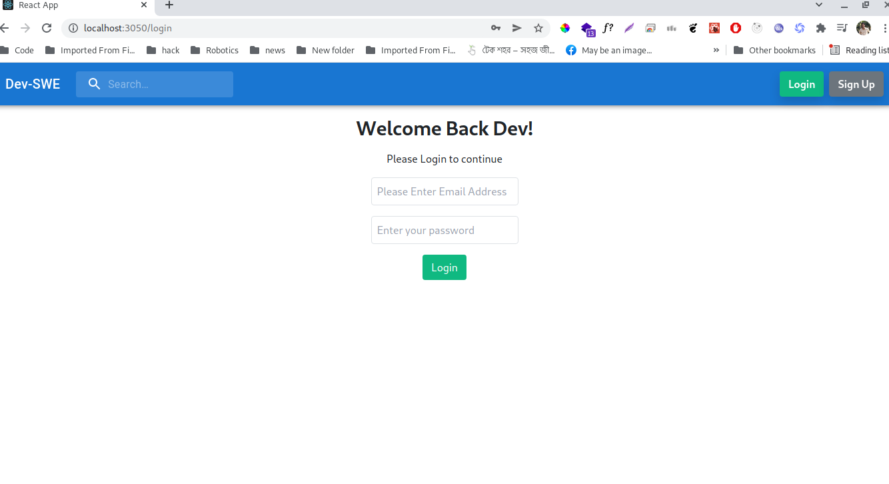
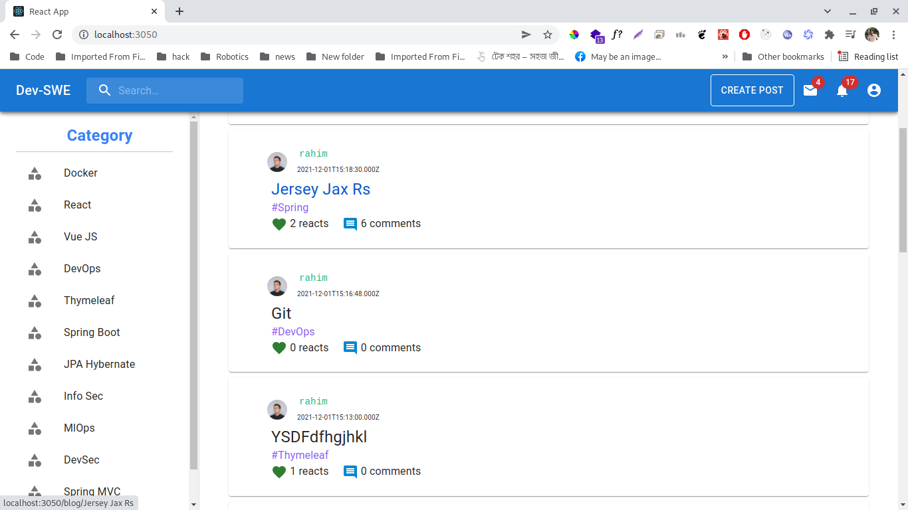
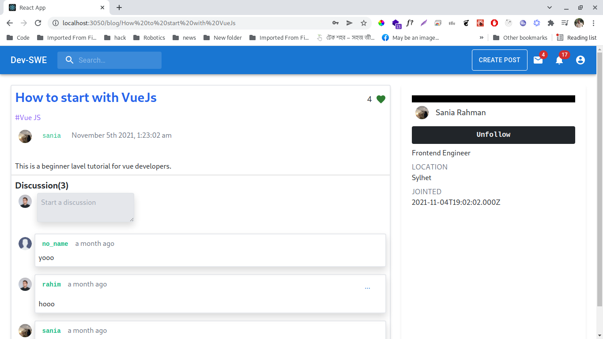
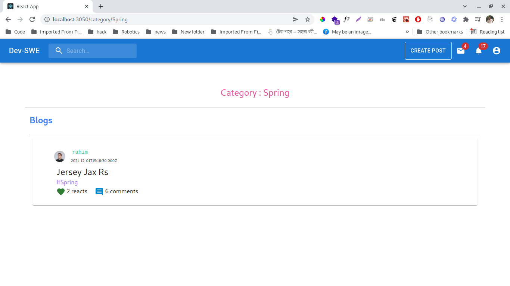
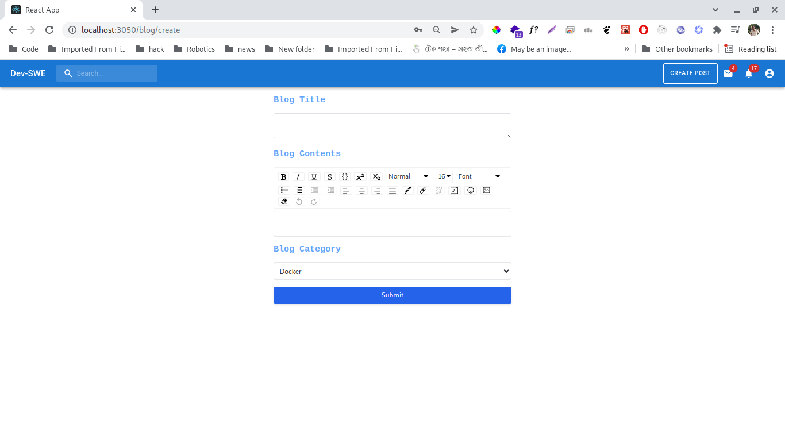
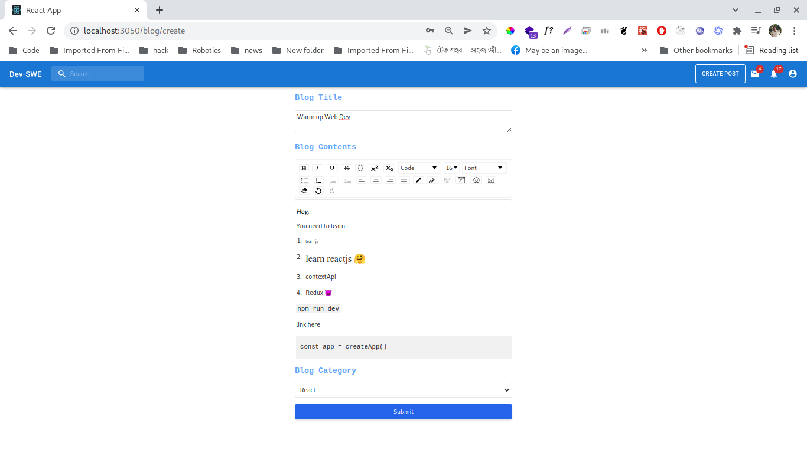
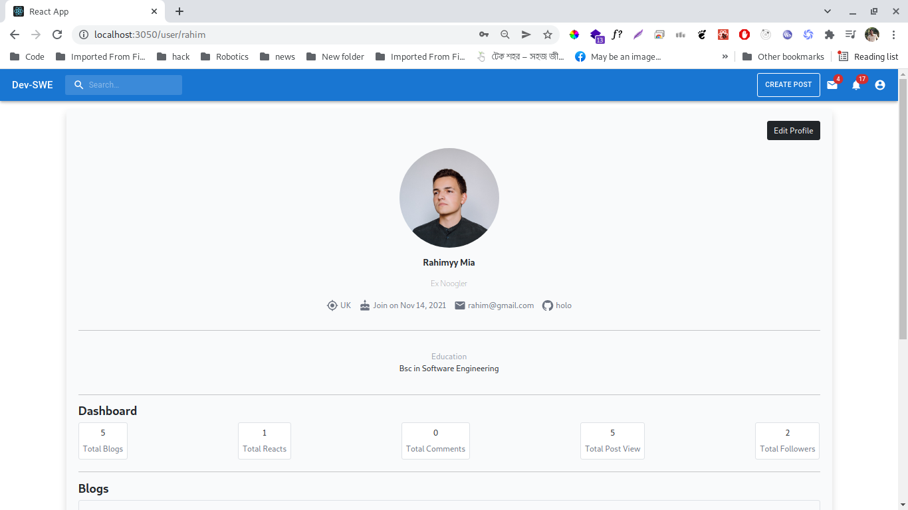
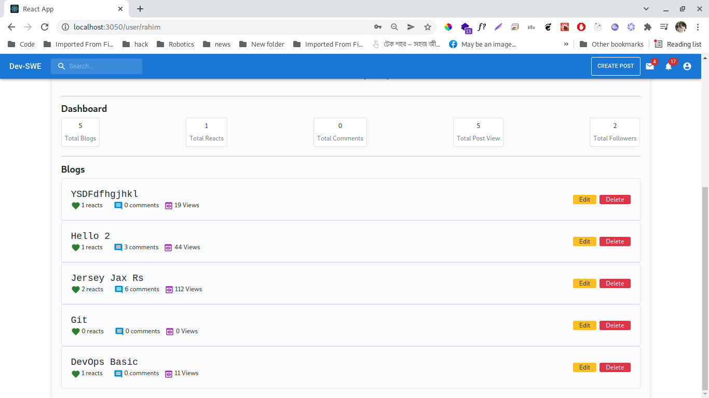

# Dev-SWE

## Intro

Dev-SWE is a simple blogging web application for Software Engineering Developer community where dev can share their knowledge with others by writing blogs.

## Features

- Write blog (also edit,delete) on category wise topics
- lke/unlike on blog
- comments (add,edit,delete) on blog
- follow/unfollow writer
- User dashboard

## User Interface

## Developers

#### How To Run

`docker-compose up`

#### Tech Stack

- Frontend Library : **ReactJS**
- React UI Library : **Material UI**
- CSS framework : **TailwindCSS**
- Backend : **ExpressJS**
- Database : **mysql(sequelize)**
